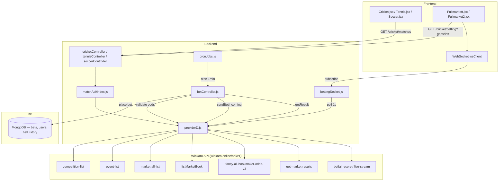

# Provider D — Sports Architecture (Winkaro Betfair APIs)

Complete reference: match listing → odds display → bet placement → settlement.  
Provider implementation: `aura-backend/services/matchApi/providerD.js`

---

## 1. Activation & Config

| Env variable | Purpose | Default |
|---|---|---|
| `API_PROVIDER` | Active provider (`providerD`) | `providerA` |
| `PROVIDER_D_API_URL` | Winkaro base URL | `https://winkaro.online/api/v1` |
| `PROVIDER_D_API_KEY` | API auth key | falls back to `API_KEY` |

**Activate Provider D:**
```env
API_PROVIDER=providerD
PROVIDER_D_API_URL=https://winkaro.online/api/v1
PROVIDER_D_API_KEY=your_key_here
```

Provider is selected in `aura-backend/services/matchApi/index.js` and exported as `fetchMatchList`, `fetchMatchData`, `getResult`, `sendBetIncoming`, etc.

---

## 2. Sport IDs (Betfair)

| Sport | Betfair `sportId` | Frontend `sid` | Listing route |
|---|---|---|---|
| Soccer | 1 | 1 | `/api/soccer/matches` |
| Tennis | 2 | 2 | `/api/tennis/matches` |
| Cricket | 4 | 4 | `/api/cricket/matches` |

Defined in `providerDHelpers.js` → `BETFAIR_SPORT_IDS`.

---

## 3. High-Level Architecture



---

## 4. Winkaro External APIs (Provider D)

All requests use `?key=API_KEY` (GET) or body + `?key=API_KEY` (POST).

| # | Method | Endpoint | Used for |
|---|---|---|---|
| 1 | GET | `/betfair/competition-list/{sportId}` | Leagues list |
| 2 | GET | `/betfair/event-list/{sportId}/{competitionId}` | Matches per league |
| 3 | GET | `/betfair/market-all-list/{eventId}` | All exchange markets for event |
| 4 | POST | `/betfair/listMarketBook` | Live back/lay odds (max 10 marketIds/request) |
| 5 | GET | `/betfair/fancy-all-bookmaker-odds-v3/{eventId}` | Fancy + bookmaker markets |
| 6 | GET | `/betfair/fancy-bookmaker-odds/{eventId}` | Fallback if v3 empty |
| 7 | GET | `/betfair/market-odds/{eventId}/{marketId}` | Single market odds (exposed, rarely used in main flow) |
| 8 | POST | `/result/get-market-results` | Market settlement result |
| 9 | GET | `/betfair-score?gmid={eventId}` | Scorecard iframe URL |
| 10 | GET | `/live-stream?gmid={eventId}` | Live stream (frontend direct) |

**NOT used in Provider D (legacy):**
- `/esid`
- `/getPriveteData`
- External bet-incoming API (bets are local only)

---

## 5. Match Listing Flow

### 5.1 User journey

```
/sports/cricket  →  Cricket.jsx  →  GET /api/cricket/matches  →  MatchListSection + MatchRow
```

Click row → navigate to:
```
/sports/fullmarket/{matchName}/{eventId}
```
Example: `/sports/fullmarket/Rewa%20Jaguars%20v%20Gwalior%20Cheetahs/35715761`

`gmid` / `gameid` = **Betfair event.id** (e.g. `35715761`), not legacy diamond id.

### 5.2 Backend chain

```
Cricket.jsx
  → cricketSlice.fetchCricketData()
  → GET /api/cricket/matches
  → cricketController.getCricketData()
  → fetchMatchList(4)          // sportId = 4 cricket
  → providerD.fetchMatchList()
```

### 5.3 Provider D: `fetchMatchList(sportId)`

**Step A — Collect all events**
```
GET /betfair/competition-list/{sportId}
  → for each competition (parallel, concurrency=4):
      GET /betfair/event-list/{sportId}/{competitionId}
      → merge into events[]
```

**Step B — Normalize to legacy list shape**
`normalizeEventToListMatch()` produces:
```json
{
  "gmid": 35715761,
  "beventId": 35715761,
  "ename": "Rewa Jaguars v Gwalior Cheetahs",
  "stime": "2026-06-15T10:00:00.000Z",
  "cname": "T20 Blast",
  "section": [ /* placeholder odds 0/0 */ ]
}
```

**Step C — Enrich each match with Match Odds preview**
For each match (parallel, concurrency=5):
```
GET /betfair/market-all-list/{eventId}
  → find market where marketName contains "match odds"
POST /betfair/listMarketBook  { marketIds: ["1.xxx"] }
  → applyMatchOddsToListMatch() fills section[] with back/lay
```

**Step D — Controller transforms for frontend**
`cricketController.getCricketData()` maps `section[]` → `odds[]` array (team1, draw placeholder, team2) and returns:
```json
{
  "success": true,
  "matches": [
    {
      "id": 35715761,
      "beventId": 35715761,
      "match": "Rewa Jaguars v Gwalior Cheetahs",
      "date": "2026-06-15T10:00:00.000Z",
      "cname": "T20 Blast",
      "odds": [
        { "home": "1.85", "away": "1.90", "backVolume": "500", "layVolume": "300" },
        { "home": "0", "away": "0" },
        { "home": "2.10", "away": "2.15", "backVolume": "400", "layVolume": "250" }
      ],
      "inplay": false
    }
  ]
}
```

### 5.4 Frontend listing display

| File | Role |
|---|---|
| `frontend/src/pages/sports/Cricket.jsx` | Fetch matches, filter InPlay/Today/Tomorrow, group by league |
| `frontend/src/components/sports/MatchListSection.jsx` | League accordion |
| `frontend/src/components/sports/MatchRow.jsx` | Row UI + click → fullmarket |
| `frontend/src/components/sports/matchListUtils.js` | `buildOddsColumns()`, date formatting |

---

## 6. Full Market / Betting Page Flow

### 6.1 User journey

```
/sports/fullmarket/{name}/{gameid}
  → Fullmarkett.jsx (cricket)
  → initial: GET /api/cricket/betting?gameid=35715761
  → live: WebSocket subscribe { type: "subscribe", gameid, apitype: "cricket" }
```

Tennis/Soccer use `Fullmarket2.jsx` with `apitype: "tennis"` / `"soccer"`.

### 6.2 Backend chain (HTTP)

```
GET /api/cricket/betting?gameid=35715761
  → cricketController.fetchCrirketBettingData()
  → fetchMatchData(gameId, 4)
  → providerD.fetchMatchData()
```

4-second in-memory cache in `cricketController` (`CRICKET_BETTING_CACHE_MS = 4000`).

### 6.3 Provider D: `fetchMatchData(gameId, sportId)`

**Step 1 — Resolve event ID**
```
GET /betfair/market-all-list/{gameId}   // if returns markets → gameId IS eventId
else search all events for matching id
```

**Step 2 — Build exchange markets**
```
GET /betfair/market-all-list/{eventId}
  → marketIds = all markets
POST /betfair/listMarketBook  { marketIds: [...] }   // chunks of 10
  → mergeMarketMetaWithBook(meta, book) for each market
```

**Step 3 — Fancy / Bookmaker**
```
GET /betfair/fancy-all-bookmaker-odds-v3/{eventId}
  → if empty: GET /betfair/fancy-bookmaker-odds/{eventId}
  → parseFancyBookmakerPayload()
```

**Step 4 — Merge & dedupe**
Exchange markets + fancy markets (fancy ids deduped).

### 6.4 Normalized market object (exchange)

`mergeMarketMetaWithBook()` output:
```json
{
  "id": "1.234567890",
  "marketId": "1.234567890",
  "mid": "1.234567890",
  "gmid": 35715761,
  "name": "Match Odds",
  "mname": "MATCH_ODDS",
  "mtype": "MATCH_ODDS",
  "status": "OPEN",
  "inplay": true,
  "matched": 125000,
  "runners": [
    { "id": 123, "name": "Rewa Jaguars", "back": [{ "price": 1.85, "size": 500 }], "lay": [{ "price": 1.86, "size": 300 }] }
  ],
  "section": [
    {
      "nat": "Rewa Jaguars",
      "sid": 123,
      "gstatus": "ACTIVE",
      "odds": [
        { "oname": "back1", "otype": "back", "odds": 1.85, "size": 500 },
        { "oname": "lay1", "otype": "lay", "odds": 1.86, "size": 300 }
      ]
    }
  ]
}
```

**Market name mapping:**

| Betfair `marketName` | `mname` | `mtype` |
|---|---|---|
| Match Odds | MATCH_ODDS | MATCH_ODDS |
| Tied Match | TIED_MATCH | TIED_MATCH |
| *bookmaker* | Bookmaker | BOOKMAKER |
| fancy names | original | INNINGS_RUNS / oddeven / etc. |

### 6.5 Frontend market components

`Fullmarkett.jsx` filters `bettingData` by `mtype` / `mname`:

| Component | Filter |
|---|---|
| `Matchodds.jsx` | `mtype === "MATCH_ODDS"` |
| `TiedMatch.jsx` | `mtype === "TIED_MATCH"` |
| `Bookmakers.jsx` | bookmaker markets |
| `Fancybet.jsx` | fancy / innings runs |

`normalizeRunnersToSection()` bridges `runners[]` (Betfair) ↔ `section[]` (legacy UI).

### 6.6 WebSocket live updates

**File:** `aura-backend/socket/bettingSocket.js`

```
Client → { type: "subscribe", gameid: "35715761", apitype: "cricket" }
Server → setInterval(pollBettingData, 1000)
  → fetchMatchData(gameid, sid)
  → if data changed → send { type: "bettingData", gameid, data: markets[] }
```

| apitype | sid |
|---|---|
| cricket | 4 |
| tennis | 2 |
| soccer | 1 |

Frontend `wsClient` in `Fullmarkett.jsx` receives `bettingData` and updates UI without extra HTTP polling.

---

## 7. Min/Max Limits (Important)

**Betfair APIs do NOT return `min`, `max`, `maxb`, `maxLiabilityPerBet`.**

UI reads limits via `frontend/src/utils/marketLimits.js`:
- `getMarketMaxLimit(market)` → 0 if fields missing
- `getMarketMinLimit(market)` → 0 if fields missing

Legacy `/getPriveteData` used to send `max: 2000, maxb: 10000`. Provider D does not map these — **0/0 is a frontend default, not Betfair data.**

---

## 8. Bet Placement Flow

### 8.1 Frontend → Backend

**Match Odds / Tied Match:**
```
POST /api/user/place-bet
```
via `betReducer.createBet()` → `placeBetUnified()` → `placeBet()`

**Fancy bets:**
```
POST /api/user/place-fancy-bet
```
via `createfancyBet()` → `placeFancyBet()`

### 8.2 Frontend request body (Match Odds example)

```json
{
  "gameId": "35715761",
  "sid": 4,
  "price": 100,
  "xValue": "1.85",
  "gameType": "Match Odds",
  "gameName": "Cricket Game",
  "teamName": "Rewa Jaguars",
  "otype": "back",
  "oname": "back1",
  "marketName": "MATCH_ODDS",
  "eventName": "Rewa Jaguars v Gwalior Cheetahs",
  "fancyScore": null
}
```

Set in `Fullmarkett.jsx` → `formData` + `placeBet()`.

### 8.3 Server-side validation

`marketValidation.validateSportsMarket()`:
1. **Fresh fetch** — `fetchMatchData(gameId, sid)` (never stale cache)
2. Find market by `mname` / alias (`MATCH_ODDS` ↔ `Match Odds`)
3. Check market/selection not SUSPENDED
4. Compare user `xValue` vs live odds (tolerance 0.01)
5. Return `marketMeta` with `mid` (Betfair marketId like `1.xxx`)

### 8.4 External API on bet place

`providerD.sendBetIncoming()` — **no external call**:
```js
return { success: true, local: true };
```

Payload logged (for reference only):
```json
{
  "event_id": "35715761",
  "event_name": "Rewa Jaguars v Gwalior Cheetahs",
  "market_id": "1.234567890",
  "market_name": "Match Odds",
  "market_type": "Match Odds",
  "sport_id": 4,
  "sport_name": "Cricket",
  "runners": [ /* from marketMeta */ ]
}
```

### 8.5 MongoDB storage

`betModel` saved with:
- `gameId` = event id (`35715761`)
- `market_id` = Betfair market id (`1.xxx`) when available from validation
- `gameType`, `marketName`, `teamName`, `otype`, `xValue`, `betAmount`, `status: 0`

Exposure/balance updated locally. No bet sent to Betfair exchange.

---

## 9. Result / Settlement Flow

### 9.1 Cron schedule

**File:** `aura-backend/controllers/cronJobs.js`

| Job | Interval | Function | Bet types |
|---|---|---|---|
| Sports settlement | every 1 min | `updateResultOfBets` | Match Odds, Tied Match, Bookmaker, Toss, O/U |
| Fancy settlement | every 10 sec | `updateFancyBetResult` | Normal, line, ball, meter, khado fancy |
| Reconcile | every 60 sec | `reconcileOrphanedBetHistory` | DB only, no API |

### 9.2 Sports settlement (`updateResultOfBets`)

For each unsettled bet group (`gameId` + `marketName`):

**API call:**
```
providerD.getResult({
  event_id: 35715761,
  event_name: "Rewa Jaguars v Gwalior Cheetahs",
  market_id: "1.234567890",
  market_name: "Match Odds",
  sport_id: 4
})
```

**Provider D resolves marketId:**
1. Use `payload.market_id` if contains `.` (Betfair format)
2. Else `GET /betfair/market-all-list/{eventId}` + `findMarketIdByName()`

**Result API:**
```
POST /result/get-market-results
Body: { "marketIds": ["1.234567890"] }
```

**Normalized response:**
```json
{
  "final_result": "Rewa Jaguars",
  "marketId": "1.234567890"
}
```

If API returns empty → skip (market not settled yet).

**Settlement:**
`sportsSettlementService.settleSportsBet(bet, user, winner)` → update `betModel`, `betHistory`, user balance/exposure.

Special cases: `void`, `tied` handled in `updateResultOfBets`.

### 9.3 Fancy settlement (`updateFancyBetResult`)

For fancy bets, `getResult()` is called with `market_name` (e.g. `"Normal"`).

**Limitation:** Fancy markets may NOT exist in `market-all-list` (exchange-only). If `market_id` was not saved at bet time and name resolution fails → settlement may skip.

Provider B/C used `fetchCricketFancyResult` — **not available in Provider D** (throws not configured).

### 9.4 Manual settlement

Admin can settle via `manualResultController.js` → `settleSportsBet()`.

---

## 10. Scorecard & Live Stream

### Backend scorecard
```
GET /api/cricket/scorecard?gameid=35715761
  → fetchScore(gameid, 4)
  → GET /betfair-score?gmid={eventId}&key=...
```

### Frontend direct (no backend proxy)
`frontend/src/utils/sportsMediaUrls.js`:
```
liveStreamUrl  = {BASE}/live-stream?gmid={eventId}&key={key}
scorecardUrl   = {BASE}/betfair-score?gmid={eventId}&key={key}
```

Env: `VITE_PROVIDER_D_API_URL`, key from app config.

---

## 11. Data Format Bridge (Legacy ↔ Betfair)

| Legacy (`getPriveteData`) | Betfair (Provider D) |
|---|---|
| `section[].nat` | `runners[].runnerName` |
| `section[].odds[].odds` | `ex.availableToBack[0].price` |
| `section[].odds[].size` | `ex.availableToBack[0].size` |
| `section[].odds[].oname` | mapped: `back1` / `lay1` |
| `gmid` (diamond) | `event.id` (Betfair) |
| `mid` | `marketId` (`1.xxx`) |
| `max`, `maxb`, `min` | **not provided** |

Helpers in `providerDHelpers.js`:
- `runnerExToOdds()` — Betfair runner → legacy odds[]
- `runnersToSection()` — runners → section[]
- `mergeMarketMetaWithBook()` — catalog + live book merge

---

## 12. File Map

### Backend
| File | Purpose |
|---|---|
| `services/matchApi/index.js` | Provider switch (`API_PROVIDER`) |
| `services/matchApi/providerD.js` | All Winkaro API calls |
| `services/matchApi/providerDHelpers.js` | Response normalizers |
| `controllers/cricketController.js` | `/cricket/matches`, `/cricket/betting`, scorecard |
| `controllers/tennisController.js` | Tennis equivalents (sportId=2) |
| `controllers/soccerController.js` | Soccer equivalents (sportId=1) |
| `socket/bettingSocket.js` | WebSocket poll + push |
| `utils/marketValidation.js` | Pre-bet odds validation |
| `controllers/betController.js` | placeBet, settlement crons |
| `services/sportsSettlementService.js` | Win/loss P/L logic |
| `controllers/cronJobs.js` | Cron triggers |

### Frontend
| File | Purpose |
|---|---|
| `pages/sports/Cricket.jsx` | Match listing |
| `pages/sports/Fullmarkett.jsx` | Cricket full market + bets |
| `pages/sports/Fullmarket2.jsx` | Tennis/Soccer full market |
| `features/sports/cricketSlice.js` | API calls for matches/betting |
| `features/sports/betReducer.js` | place-bet API |
| `components/leaguescomp/Matchodds.jsx` | Match Odds UI |
| `components/leaguescomp/TiedMatch.jsx` | Tied Match UI |
| `components/sports/MatchRow.jsx` | Listing row + navigation |
| `utils/marketLimits.js` | min/max display |
| `utils/sportsMediaUrls.js` | Stream/score URLs |

---

## 13. End-to-End Example: Event `35715761`

```
1. LISTING
   Frontend GET /cricket/matches
   → competition-list/4 → event-list/4/{compId} (many calls)
   → per match: market-all-list/35715761 + listMarketBook
   → MatchRow shows back/lay for team1 & team2

2. OPEN MATCH
   User clicks → /sports/fullmarket/.../35715761
   GET /cricket/betting?gameid=35715761
   → market-all-list/35715761
   → listMarketBook (all exchange markets, chunked)
   → fancy-all-bookmaker-odds-v3/35715761
   → UI: Matchodds, TiedMatch, Bookmakers, Fancybet

3. LIVE UPDATES
   WS subscribe → bettingSocket polls fetchMatchData every 1s
   → pushes bettingData to client

4. PLACE BET (Match Odds, back Rewa Jaguars @ 1.85, stake 100)
   POST /user/place-bet { gameId: 35715761, sid: 4, ... }
   → validateSportsMarket (fresh fetchMatchData)
   → sendBetIncoming (local only, no API)
   → save betModel, update balance/exposure

5. SETTLEMENT (after match)
   Cron updateResultOfBets (1 min)
   → POST /result/get-market-results { marketIds: ["1.xxx"] }
   → { final_result: "Rewa Jaguars" }
   → settleSportsBet → status 1 (win) or 2 (loss)
```

---

## 14. Known Gaps / Not Configured in Provider D

| Feature | Status |
|---|---|
| `sendBetIncoming` external API | Skipped — local DB only |
| `min` / `max` stake limits | Not from Betfair — shows 0 |
| `fetchCasinoTables/Data/Result` | Throws not configured |
| `fetchCricketFancyResult` | Throws not configured |
| `fetchAllIframes` | Throws not configured |
| Fancy result via market name only | May fail if not in market-all-list |
| Some `event-list/{compId}` | Returns 404 — competition skipped |

---

## 15. Quick API Cheat Sheet

```
# Listing (internal)
fetchMatchList(sportId)
  → GET competition-list/{sportId}
  → GET event-list/{sportId}/{compId}
  → GET market-all-list/{eventId} + POST listMarketBook (per match)

# Full market (internal)
fetchMatchData(gameId, sportId)
  → GET market-all-list/{eventId}
  → POST listMarketBook
  → GET fancy-all-bookmaker-odds-v3/{eventId}

# Bet (internal — no external)
sendBetIncoming(payload) → { success: true, local: true }

# Result (external)
getResult(payload)
  → POST /result/get-market-results { marketIds: ["1.xxx"] }
  → { final_result: "Winner Name" }

# Score (external)
fetchScore(gmid, sid)
  → GET /betfair-score?gmid={eventId}
```

---

*Last updated: Provider D implementation on Winkaro Betfair wrapper APIs.*
